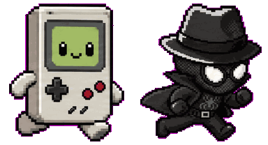
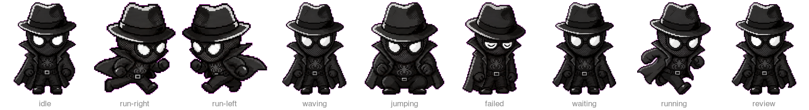

<div align="center">

# Mini Pet Agents

**Animated desktop pets for macOS that are also AI coding agents.**



Pick a sprite pet, drop it on your screen, click it, and you are talking to
Claude Code, Codex, Copilot, or Cursor — each pet its own agent, its own
working directory, its own conversation.

</div>

---

## What it does

A pet is a small always-on-top window that paces above your dock, wanders your
desktop, or stacks against a screen edge. Clicking it opens a chat popover
wired to an AI CLI running as a subprocess. The pet's animation reflects what
the agent is doing: it studies something while a turn is in flight, jumps when
the answer lands, and slumps if the CLI errors.

The pets themselves come from [petdex](https://petdex.dev) — a community
library of sprite packs. Nothing is bundled; you install the ones you want.

| | |
|---|---|
| **Five CLIs** | Claude Code, Codex, Copilot, Cursor — set globally or per pet, so two pets can answer the same prompt from different models |
| **Per-pet context** | Each pet remembers its own working directory, model, and chat history |
| **Four placements** | Dock, free roam, left stack, right stack — drag a pet to re-home it |
| **Throwable** | Fling a pet and it glides, bounces off screen edges, and settles where it runs out of momentum |
| **Broadcast** | Fan one prompt out to every pet at once and compare answers |

## Sprite states

Every petdex pack ships the same nine animation rows. The app drives all of
them from agent activity — no synthetic rotation or squash effects, only the
frames the artist drew.



| State | When it plays |
|---|---|
| `idle` | Resting between walks |
| `run-right` / `run-left` | Walking; the row swaps with direction of travel |
| `running` | Occasional sprint burst mid-walk |
| `waving` | While you hover the pet |
| `waiting` | Agent is thinking |
| `review` | Chat is open, or the agent is using a tool |
| `jumping` | Turn completed — pairs with the reply bubble |
| `failed` | The CLI returned an error |

## Requirements

- macOS 14 (Sonoma) or later
- Xcode 15+ to build
- At least one AI CLI on your `PATH`:

| Provider | Binary | Install |
|---|---|---|
| Claude Code | `claude` | [claude.ai/download](https://claude.ai/download) |
| Codex | `codex` | `npm i -g @openai/codex` |
| Copilot | `copilot` | `npm i -g @github/copilot` |
| Cursor | `cursor-agent` | [cursor.com/cli](https://cursor.com/cli) |

Gemini is implemented (`GeminiSession.swift`, targeting the Antigravity `agy`
binary) but hidden from the UI: `agy` is an autonomous coding agent with no
chat-only mode, so it goes exploring the filesystem instead of answering like a
pet. Drop the filter in `AgentProvider.selectableCases` to re-enable it.

## Build and run

```bash
git clone https://github.com/Dev-Muhammad-Junaid/MiniPetAgents.git
cd MiniPetAgents
open app/MiniPetAgents.xcodeproj
```

No signing team is committed, so a fresh clone builds with "Sign to Run
Locally" out of the box. To run it on your own hardware normally, set your team
under **Signing & Capabilities**.

Then: build and run → a paw icon appears in the menubar → **Pet Gallery…** →
install a pet → flip its **Spawn** toggle.

## Using a pet

| Action | Result |
|---|---|
| **Click** | Open the chat popover |
| **Hover** | Pet waves until you leave |
| **Drag** | Pick it up; a drop-zone overlay highlights where it will land |
| **Drag fast and release** | Throw — it glides, bounces off edges, settles, then wanders from there |
| **Click the reply bubble** | Dismiss it and return the pet to its mood loop |

Throw physics live as constants at the top of
[`WalkerCharacter.swift`](app/MiniPetAgents/WalkerCharacter.swift) —
release-speed threshold, air drag, restitution, and settle speed are all one
number each. A fast release only goes ballistic when you let go over open
space; flinging at the dock still docks the pet.

## Where things live

| Area | File |
|---|---|
| Menubar, per-pet submenus, app defaults | [`LilAgentsApp.swift`](app/MiniPetAgents/LilAgentsApp.swift) |
| 60 Hz tick loop, spawn/despawn, dock geometry | [`LilAgentsController.swift`](app/MiniPetAgents/LilAgentsController.swift) |
| The pet itself — window, sprite, drag, throw, chat | [`WalkerCharacter.swift`](app/MiniPetAgents/WalkerCharacter.swift) |
| Sprite sheet decode + animator | [`PetPack.swift`](app/MiniPetAgents/PetPack.swift) |
| Autonomous mood loop | [`BehaviorPlanner.swift`](app/MiniPetAgents/BehaviorPlanner.swift) |
| Placement strategies | [`PlacementMode.swift`](app/MiniPetAgents/PlacementMode.swift) |
| Installed packs + preferences | [`PetLibrary.swift`](app/MiniPetAgents/PetLibrary.swift) |
| Gallery UI (SwiftUI) | [`PetGalleryWindow.swift`](app/MiniPetAgents/PetGalleryWindow.swift) |
| Chat transcript view | [`TerminalView.swift`](app/MiniPetAgents/TerminalView.swift) |
| CLI subprocess sessions | `AgentSession.swift`, `{Claude,Codex,Copilot,Cursor,Gemini}Session.swift` |

Movement decisions and movement execution are deliberately split: the planner
picks *what state the pet should be in*, and the placement strategy decides
*where on screen that state plays out*.

## Pet packs

Packs install to `~/.codex/pets/<slug>/` as `pet.json` plus a spritesheet. The
gallery shells out to petdex's install script:

```bash
curl -sSf https://petdex.dev/install/<slug> | sh
```

(`npx petdex install` currently 403s against the npm registry, which is why the
script is used directly.)

Sheets are row-major, 8 columns × 9 rows. Most packs ship no `animations` block
in `pet.json`, so `PetPack.swift` falls back to the canonical petdex table.
That table matters: real frame counts per row are 6/8/8/4/5/8/6/6/6, and the
unused cells at the end of a row are blank — looping through them is what makes
a pet flicker out of existence at the end of a cycle.

WebP sheets are decoded once and cached beside the source as
`spritesheet.cached.png`.

## Preferences

All in `UserDefaults` under `com.minipetagents.app`:

```
pet.<slug>.spawned         on screen at launch
pet.<slug>.placement       dock | freeRoam | leftStack | rightStack
pet.<slug>.provider        per-pet CLI override
pet.<slug>.model           per-pet model override
pet.<slug>.workingDir      directory the agent runs in
pet.<slug>.displayHeight   pt, overrides the app default
pet.<slug>.popoverSize     persisted chat window size
pet.<slug>.movementMode    spriteDriven | stationary
pet.<slug>.walkSpeed       slow | normal | fast

app.defaultPetDisplayHeight
app.movementMode
app.walkSpeed
```

## Demo assets

`docs/` is generated, not hand-made:

```bash
./scripts/make-sprite-demo.sh              # sprite art from installed packs
./scripts/make-demo-gif.sh clip.mov        # screen recording → optimised GIF
```

The committed sprite art uses packs with original designs. petdex also hosts
plenty of recognisable copyrighted characters — fine to install and use
yourself, but this repo does not redistribute them.

## Known gaps

- No prebuilt download yet — clone and build. See [RELEASING.md](RELEASING.md)
  for the signing and notarization checklist.
- Sparkle is wired up but no appcast is published yet, so automatic update
  checks are switched off in `Info.plist`.
- No automated tests.

## License

MIT — see [LICENSE](LICENSE).

This project's architecture and its AI CLI session layer derive from
**LilAgents** by Ryan Stephen (MIT). Sprite packs belong to their individual
petdex authors and are fetched at runtime, never bundled. Full attributions are
in [NOTICE.md](NOTICE.md).
